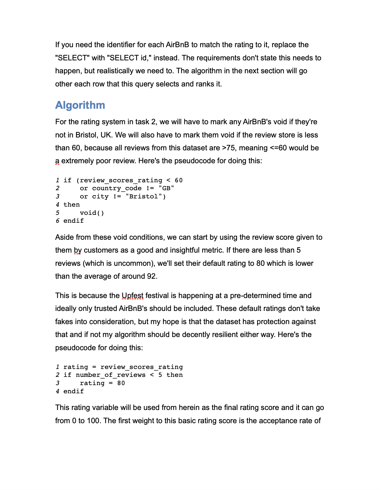

# mdcx

Seamless markdown to docx converter.

## Example

Command-line:

```shell
$ mdcx hippo.md hippo.docx
```

In Python:

```python
from mdcx import Document

doc = Document("Markdown here!")
doc.save("example.docx")
```

## Installation

To install mdcx, simply download it from PyPI:

```shell
$ pip3 install mdcx
```

## Showcase

Here's a generated document from the `examples/` directory using the default theme:



## Roadmap

Here are the upcoming features for the development of mdcx:

- Markdown:
  - [ ] Heading links
  - [ ] Tables
- Quality-of-life
  - [ ] Support `#` titles as well as the current yml titles
  - [ ] Support a basic version of TOML `+++` metadata
- Extras:
  - [ ] Local URIs become automatic managed appendixes

This project isn't finished as not all basic markdown has been implemented. The hope for this project is to be able to seamlessly convert all well-formatted markdown to a docx.
