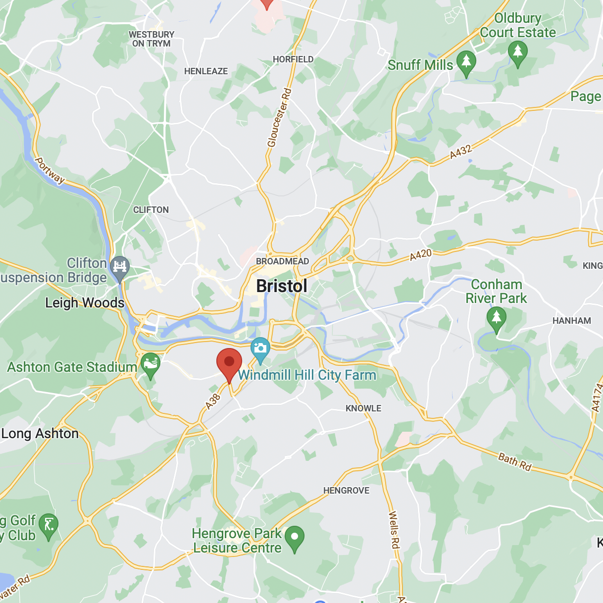
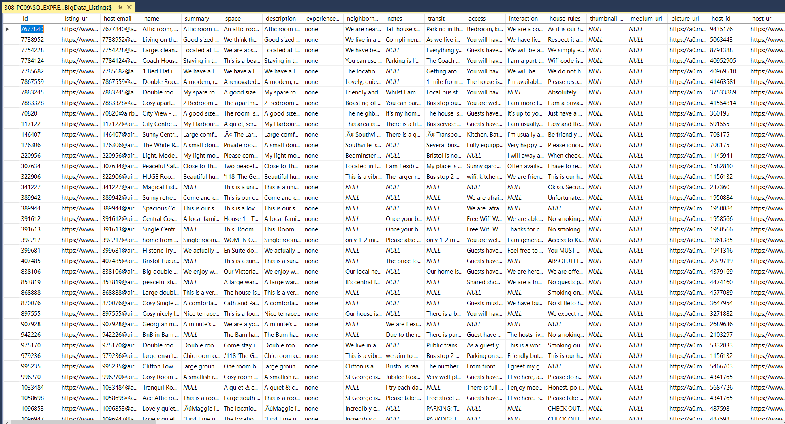
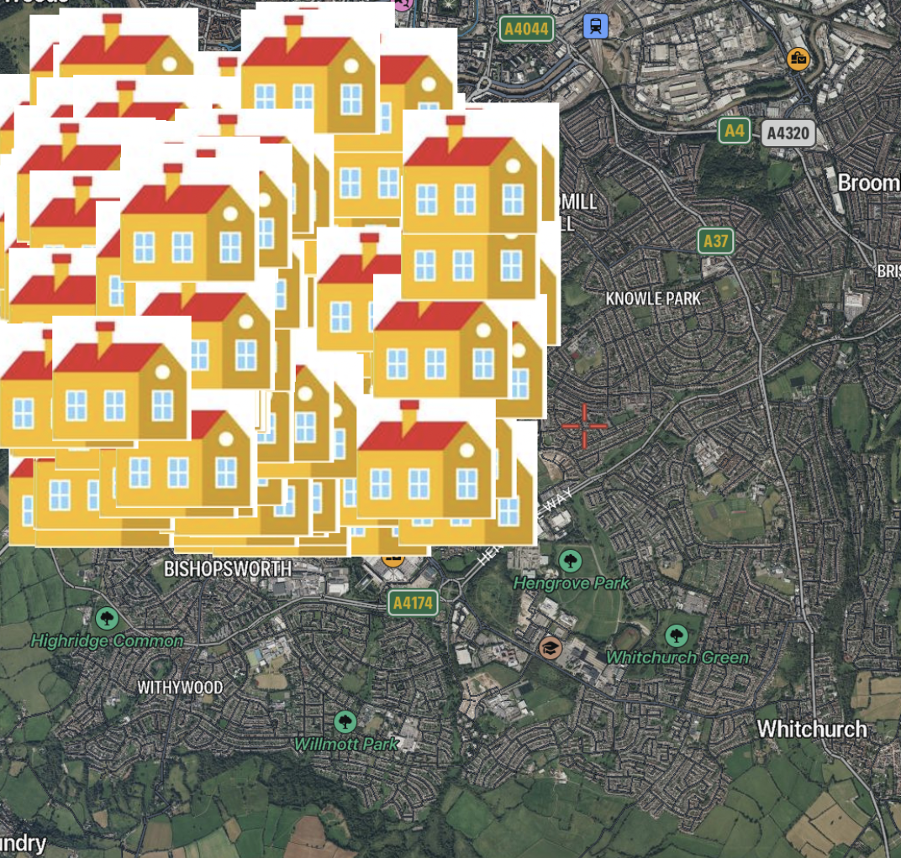

# Table of Contents

- [Table of Contents](#table-of-contents)
- [Recommendations](#recommendations)
- [Ratings](#ratings)
  - [Querying](#querying)
  - [Algorithm](#algorithm)
- [Infographic](#infographic)
  - [Querying](#querying-1)
  - [Reading](#reading)
  - [Coordinates](#coordinates)
  - [Generating](#generating)

# Recommendations

These are the following values for task 1 that seem relevant to a *wide* range of customers, including ones that *require* access arrangements:

- Host response rate: Makes sure that the owner is active so they'll respond to any requests made.
- City: The Upfest festival is in [Bristol](https://en.wikipedia.org/wiki/Bristol), so it needs to match this or locations very close by.
- Country Code: Bristol is in the UK so the country code should always match this, otherwise we might accidentally be talking about Bristol, Zimbabwe.
- Has availability: These values tell us if the AirBnB isn't full, recommending an AirBnB without any openings is useless to the customers trying to book one.
- Review Scores Rating: How high-quality the AirBnb is.
- Cancellation Policy: If the AirBnB can be cancelled (easily) if the Upfest festival is cancelled.

# Ratings

## Querying

Before the algorithm used for the rating system is discussed, we need to pull all the values from the database we'll be using to rank any given AirBnB location. To pull all rows with the values we need, we need to run this SQL query:

```sql
SELECT 
    review_scores_rating, country_code,
    city, number_of_reviews,
    host_acceptance_rate, minimum_minimum,
    security_deposit, cleaning_fee
FROM airbnb_Bristol_BigData_Listings
```

If you need the identifier for each AirBnB to match the rating to it, replace the "SELECT" with "SELECT id," instead. The requirements don't state this needs to happen, but realistically we need to. The algorithm in the next section will go other each row that this query selects and ranks it.

## Algorithm

For the rating system in task 2, we will have to mark any AirBnB's void if they're not in Bristol, UK. We will also have to mark them void if the review store is less than 60, because all reviews from this dataset are >75, meaning <=60 would be a extremely poor review. Here's the pseudocode for doing this:

```
if (review_scores_rating < 60 
    or country_code != "GB"
    or city != "Bristol")
then
    void()
endif
```

Aside from these void conditions, we can start by using the review score given to them by customers as a good and insightful metric. If there are less than 5 reviews (which is uncommon), we'll set their default rating to 80 which is lower than the average of ~92. This is because the Upfest festival is happening at a pre-determined time and ideally only trusted AirBnB's should be included. These default ratings don't take fakes into consideration, but my hope is that the dataset has protection against that and if not my algorithm should be decently resilient either way. Here's the pseudocode for doing this:

```
rating = review_scores_rating
if number_of_reviews < 5 then
    rating = 80
endif
```

This rating variable will be used from herein as the final rating score and it can go from 0 to 100. The first weight to this basic rating score is the acceptance rate of the owner. The calculation will be 110% of the acceptance rate times into the rating. The pseudocode for this looks like:

```
rating = rating * (1.1 * host_acceptance_rate)
```

I would also like to include the "superhost" value in my rating but I've not been given a description of what it does. It looks like quite a common value so I don't want to give it a ton of value inside of this rating system.

Some other values I don't want to consider into the rating system are the number of beds and the price, as well as the number of guests the AirBnB expects for this value. This is because we're looking for a wide range of clients who might want a cheaper or more expensive AirBnB and a different number of beds.

Some of the AirBnB bookings have very high minimum booking lengths. I have no information on the length of the Upfest festival so I'm assuming its 2-5 days long like typical festivals are. Because a few of these bookings have 10, 15 or even 20 day minimums I'm going to reduce their score for having these long booking times. If it's 10 or over I'll reduce the rating by 25% and if its over 20 I'll half their score. Here's the pseudocode for doing this:

```
if minimum_minimum >= 20 then
    rating = rating / 2
else if minimum_minimum >= 10 then
    rating = rating * 0.75
endif
```

This was hard to figure out because theres "minimum minimum", "minimum maximum", "maximum minimum" and a "maximum maximum", making the database feel like latin. I chose the first "minimum minimum" because it seems like it's the absolute minimum value a user can book, and because I'm guessing.

I want to make sure that the security deposit and the cleaning fees aren't secretly half the cost of the AirBnB. Because the security deposit is ususally justifiably high, I divide it by 10 and then add these two values together and then divide it by the price to get the *extras:price* ratio. Once I have this, I need to cap it from a 0 to a 1 so theres a limit to the impact of the cleaning fees, and so my math doesn't mess up.

Once I have this decimal value, I divide it by 10 and minus it from the rating. This will bring *all* ratings down unless there's no security deposit and cleaning fee. I chose this division value because I tested a few values and this eyeball figure looked decent. Also, sometimes the input values are null so I have to set them to zero. Here's the pseudocode for doing this:

```
if security_deposit == null then
    security_deposit = 0.00
endif
if cleaning_fee == null then
    cleaning_fee = 0.00
endif

ratio = (security_deposit / 10 + cleaning_fee) / rating
rating = rating - ratio / 10
```

# Infographic

## Querying

For task 3 I need to make an infographic (a well-designed graph for public consumption) to display the suitable AirBnB locations near the festival area. This will require more in-depth querying of the database and a bit of mapping.

The first task is to find the approximate maximum bounds of the area radius we want to make the infographic for. I went on Google Maps and found the festival area listed on the requirements sheet called [Bedminster](https://en.wikipedia.org/wiki/Bedminster,_Bristol) which is a district in the south of Bristol. Now that I've determined the location of the event, I need to pick the radius which is suitable for short travel.



There aren't many bridges over the west-to-east river flowing 500m north of Bedminster so I don't want to target anything past the bridge. I'm thinking that I should go about a km in all other directions. This gives me a 2kmx1.5km rectangle of suitable area thanks to the layout of Bristol. Now I need to translate the four corners of this rectangle into four coordinates which can be the search bounds for my database query. After using Google Maps further, these coordinates will be:

- Top left: 51.444667, -2.625611
- Bottom left: 51.424528, -2.625611
- Top right: 51.444667, -2.564944
- Bottom right: 51.424528, -2.564944

As you might be able to tell, half of these values are the same. To simplify these coordinates, we only really need to check the database against the top left and bottom right bounds of the rectangle listed here, because these are the only two which are completely unique. To get all of the locations within this area, we run an SQL query which uses these bounds:

```sql
SELECT * 
FROM airbnb_Bristol_BigData_Listings
WHERE
    latitude<51.444667 AND latitude>51.424528 AND
    longitude<-2.564944 AND longitude>-2.625611
```

This query executed successfully on the AirBnB dataset and gave me exactly 321 results back, instead of the 2396 rows that it normally supplies to us. Now I can export these 321 results into a .csv file to use in the next section to generate the actual infographic image.



I'm querying all database rows with the "*" wildcard in SQL simply because its quicker for me to do as a developer. There aren't any performance or other constraints because this whole process is being used to generate one (or more) maps to then distribute in it's finished form.

## Reading

To generate the image for the infographic, I'm going to be using the [Python](https://www.python.org) programming language. I'm using this because I have a lot of prior knowledge of the language and ecosystem, and because it's got a very capable selection of image editing libraries so that I can generate the infographic quickly.

The image generation library which I'm going to be using is called [Pillow](https://pillow.readthedocs.io/en/stable/), it's an updated and maintained version of the old [PIL](https://en.wikipedia.org/wiki/Python_Imaging_Library) library which can hardly be used nowadays. I took a screenshot from a [separate](https://satellites.pro/UK_map) mapping service to be the background map of the infographic, and can use it as the base image like so:

```python
from PIL import Image
im = Image.open("map.png")
```

After getting the image, I need to open the .csv file I exported from the database query previously and convert it to something I can actually use inside of my program. Here's the code I used to accomplish this task:

```python
import csv

class Listing:
    def __init__(self, row: str):
        self.id = row[0]
        self.lat = float(row[43])
        self.long = float(row[44])

file = open("bristol.csv", "r", newline="")
r = csv.reader(file, delimiter=",", quotechar='"')

listings = []
for ind, row in enumerate(r):
    if ind == 0:
        print(row)
        continue

listings.append(Listing(row))
```

I can now use the listings variable made in the last bit of this code to easily access the listings. Now, all I have to do is loop over every listing and add it to the map and then show the image. I can sort of do it with this code that adds an icon to the image for every listing:

```python
# Add to image
icon = Image.open("house.png")
for listing in listings:
    im.paste(icon)

# Display image
im.show()
```

## Coordinates

To make each of these dots actually line up with the map, I need to translate the coordinates to relative positions on the map which is a bit complicated.

```python
class Listing:
    ...

    def px(self) -> tuple:
        """Translates lat and long to 1418x758 image area"""
        # Maximum coordinates
        MAX_LAT = 51.444667
        MAX_LONG = -2.625611
        # Get max difference of coordinates
        MAX_LAT_DIFF = MAX_LAT - 51.424528
        MAX_LONG_DIFF = MAX_LONG - -2.564944
        # Get our difference
        lat_diff = MAX_LAT - self.lat
        long_diff = MAX_LONG - self.long
        # Position of our lat/long inside of max diff
        lat_ratio = lat_diff / MAX_LAT_DIFF
        long_ratio = long_diff / MAX_LONG_DIFF
        # Get pixels by timing pixels by this
        x = int(long_ratio * 1418)
        y = int(lat_ratio * 758)
        return (x, y)
```

This calculates the maximum difference of the latitudes and longitudes (the space between the minimum and the maximum) and then checks the difference of the inputted latitudes and longitudes. For example, if x is 16 and y is 20 then the maximum difference would be 4. However, if our value is 17 then the difference would be 3. 

Because we now have the maximum difference and our difference, we can check to see how far away from the maximum our difference was. We can make it into a fraction by just dividing ours by the maximum. From the previous example, it would be 3/4, which is 75% of the maximum difference. This fraction can be used as this percentage to adjust for the pixels. To integrate this into the image pasting loop, I replace "im.paste(icon)" with "im.paste(icon, listing.px())" which sets the top-left point of the image right at the converted pixel values.

I installed some extremely high-quality icons to use as development images for an initial test and this is what came out of the infographic generator:



Unfortunately, these houses don't actually line up to where they go. I have since fixed this issue (it was caused by my screenshot being 2x as large as the area of screen selected, making the icons generate only in one corner) and now I can properly generate an infographic.

## Generating

Inside of this section I'll add the final touches to the infographic, such as it's design and general layout to make it ready for public consumption. The first task is replacing the development icons which you can see in the last section with some better icons; perhaps some pins. After some consideration, I have chosen this icon to represent every AirBnB residence on my infographic:


I chose this icon because pins are commonly used in industry and because I can easily scale them up/down depending on how many AirBnB residences there are on the map.

The development icons had this issue because they where too large. Instead of showing where the houses where on the map, it instead completely covered the useful part of the map with itself, making the entire infographic useless. By using smaller pins I can alleviate this issue. With this new icon added to my generation script, the new map for the infographic looks like:

<!-- TODO:  -->

Now that I have the central map for the infographic, I need to open a graphical editor and create a nice-looking infographic around this image. I want to have a bold and eye-catching title, as well as some borders around the map image for theming.

<!-- TODO -->
